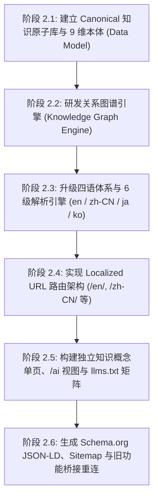

# VISUAL ATLAS · PHASE 2 全面系统审计报告 (PHASE-2-AUDIT.md)

> **审计基准**：VISUAL ATLAS 知识系统化与 AI 架构演进规范  
> **审计时间**：2026-09-06  
> **审计目标**：将网站从单纯的“Premium Art Gallery（高端图片画廊）”彻底升级为**“Visual Design Knowledge System（视觉设计知识系统）”**。  
> **执行原则**：停止继续堆砌纯视觉与过渡动效，聚焦知识模型（Knowledge Model）、知识原子（Knowledge Atom）、视觉本体论（Visual Ontology）、知识图谱（Knowledge Graph）、多语言架构（en / zh-CN / ja / ko）、Localized Routes 与 AI 可读性层（AIO / GEO / llms.txt）。

---

## 目录
1. [当前已实现内容 (Current Implementations)](#1-当前已实现内容)
2. [当前缺失内容 (Missing Capabilities)](#2-当前缺失内容)
3. [当前错误架构 (Architectural Flaws)](#3-当前错误架构)
4. [多语言问题 (Multilingual Architecture Issues)](#4-多语言问题)
5. [SEO 问题 (Search Engine Optimization Issues)](#5-seo-问题)
6. [GEO 问题 (Generative Engine Optimization Issues)](#6-geo-问题)
7. [AI 可读性问题 (AI-Readability Issues)](#7-ai-可读性问题)
8. [Knowledge Graph 问题 (Knowledge Graph Issues)](#8-knowledge-graph-问题)
9. [数据模型问题 (Data Model Issues)](#9-数据模型问题)
10. [下一阶段实施计划 (Phase 2 Implementation Roadmap)](#10-下一阶段实施计划)

---

## 1. 当前已实现内容

在 Phase 1 的视觉重构与基础功能搭建中，当前代码库已经具备良好的前端视觉基底与部分高阶交互：

| 模块 / 特性 | 源码位置 | 当前实现状态 |
|---|---|---|
| **暗房排版底色与网格** | `index.html`, `src/index.css` | 已确立 `#11110F` 底色、`#F2F0E8` 主文本、`#D8FF3E` 强调色与发丝细线网格。 |
| **瑞士国际字体体系** | `index.html`, `tailwind.config.js` | 集成 `Inter Tight`（大标）、`IBM Plex Mono`（元数据）、`Noto Sans SC`（中文字形）。 |
| **01 序幕索引 (Index Hero)** | `src/components/OpeningSequenceView.tsx` | 实现非对称编辑杂志流排版、实时视差微俯仰（Parallax Tilt）及语义光标准星遥测（Spatial Telemetry）。 |
| **02 胶片印样 (Archive)** | `src/components/ArchiveContactSheet.tsx` | 实现 Contact Sheet 印样排版模式，Hover 触发 `scale: 1.025`、暗化与 `VIEW` 浮标。 |
| **03 场景深度解构 (Scene Detail)** | `src/components/SceneDetailView.tsx` | 画面上方集成 5 档 HUD 分析模式（01 大师画幅、02 构图九宫格/黄金分割、03 色彩提取、04 光学取景框/快门角、05 光影流向与反平方衰减）。 |
| **04 视觉星图引力场 (Language)** | `src/components/VisualConstellationView.tsx` | 实现 9 节点 SVG 关系图与鼠标/触摸拖拽惯性排布，支持点击高亮关联分镜。 |
| **05 研究案卷 (Dossiers)** | `src/components/DossiersView.tsx` | 具备数字研究手记式收藏夹，支持存入分镜及学术案卷展示。 |
| **06 创作工坊 (Lab)** | `src/components/VisualLabView.tsx` | 包含 Midjourney/FLUX/Veo/Gemini 生成器、镜头构建器（通告单）、四幕故事板序列。 |
| **07 存在宣言 (About)** | `src/components/AboutManifestoView.tsx` | 实现存在主义宣言与《反 AI 设计宪章》。 |
| **全局指令面板 (⌘K)** | `src/components/CommandPalette.tsx` | 支持按键唤醒与分镜/标签模糊检索。 |
| **基础双语切换** | `src/context/LanguageContext.tsx` | 支持 `en` 与 `zh` 切换，状态持久化在 `localStorage`。 |
| **静态 AI 说明文件** | `public/llms.txt`, `public/llms-full.txt` | 建立了根目录大模型抓取入口与 JSON 知识导出。 |
| **AI 引导弹窗** | `src/components/UseWithAIModal.tsx` | 提供 Gemini/Claude/ChatGPT/Kimi 预置指令与知识库链接复制。 |

---

## 2. 当前缺失内容

根据 Phase 2 对“视觉设计知识系统”的标准要求，当前系统存在以下核心功能缺失：

1. **缺失 Canonical Concept IDs（规范化概念标示符）**：
   - 现存代码在引用视觉法则时使用任意中英文字符串（如 `"Low-Key Volumetric Rim 1:8 (体积青冷轮廓光与实用暖光)"`），没有形如 `visual.low-key-lighting`、`visual.negative-space` 的规范全局常量 ID。
2. **缺失完整的 Visual Knowledge Atom（知识原子模型）**：
   - 缺少符合规范的定义字段（`id`, `name`, `definition`, `characteristics`, `emotionalEffects`, `related`, `contrast`, `examples`, `applications`, `promptTerms`, `translations`）。
3. **缺失统一的 9 维视觉本体论（Visual Ontology）**：
   - 尚未将知识体系完整抽象为 9 大标准维度：`Mood`、`Lighting`、`Color`、`Camera`、`Composition`、`Space`、`Texture`、`Era`、`Movement`。
4. **缺失全局双向 Knowledge Graph（知识图谱关系引擎）**：
   - 无法进行实体间的双向跨维度穿透查询（如从 `visual.melancholic-nocturne` 直接反查所有关联的 `Scene`、`Style`、`Technique` 与 `Prompt`）。
5. **缺失四语言体系与优先级解析机制**：
   - 缺少 `ja`（日语）与 `ko`（韩语）的完整内容词典及本体翻译。
   - 缺少规范的多语言优先级判定流水线（1. URL locale → 2. 用户主动选择 → 3. 本地存储 → 4. 浏览器语言 → 5. 地区推断 → 6. English fallback）。
6. **缺失 Localized Routes（物理语义化路由）**：
   - 缺少形如 `/en/`, `/zh-CN/`, `/ja/`, `/ko/` 以及独立概念深链（如 `/zh-CN/visual-language/lighting/low-key/`）的路由系统。
7. **缺失独立的 AI-Readable 知识单页（/ai 与 Knowledge Concept Pages）**：
   - 现有的 `/ai` 仅为应用内部弹窗，搜索引擎蜘蛛与 AI Agent（如 cURL、GPTbot、ClaudeBot）直接抓取时无法获取静态语义 HTML。
8. **缺失多语言 `llms.txt` 矩阵**：
   - 缺少 `/en/llms.txt`、`/zh-CN/llms.txt`、`/ja/llms.txt`、`/ko/llms.txt` 分语言知识规范。
9. **缺失动态 SEO / GEO / Schema.org 结构化元数据与站点地图**：
   - 缺少针对每个概念页面的 `title`、`description`、`canonical`、`hreflang` 注入与分语言 `sitemap.xml`。
10. **老功能尚未接入新知识模型**：
    - `VirtualTourModal`、`Lightbox`、`PaletteInspectorModal`、`PromptCinemaView`、`StyleMixer` 等丰富功能处于历史代码孤岛，未与新的知识原子绑定。

---

## 3. 当前错误架构

当前系统在工程与架构层面存在 4 大结构性问题：

### 架构缺陷 1：Tab 状态驱动，而非 URL 驱动（Tab-as-State Anti-Pattern）
- **现象**：`src/App.tsx` 中通过 `const [currentTab, setCurrentTab] = useState<AtlasTab>('index')` 进行视图切换。
- **后果**：
  - 无论用户点击哪一个模块，浏览器地址始终是 `https://duguboss.github.io/Art-Gallery/`；
  - 用户无法直接分享某个分镜、某门视觉语法或 AI 页面链接；
  - 搜索引擎与 AI Agent 无法深度爬取子页面，破坏了可索引性（Indexability）与 GEO。

### 架构缺陷 2：数据分散在 4 个孤立数据源（Data Fragmentation）
- **现象**：
  1. `src/data/cinemaDefaultScenes.ts`（包含分镜与内联字符串形式的 visualDNA）
  2. `src/data/visualAtlasData.ts`（包含旧版 VISUAL_ATOMS、STYLE_RULES）
  3. `src/data/designPrinciplesData.ts`（包含旧版 DESIGN_PRINCIPLES）
  4. `src/data/stylesData.ts`（包含旧版风格卡片）
- **后果**：
  - 各文件自行定义 ID，互相无法关联；
  - 分镜页、工坊页、星图页各自硬编码自己的选项列表（例如 `VisualLabView.tsx` 内部硬编码 `moodOptions = ['Melancholic Dystopia', ...]`）；
  - 数据修改无法全站联动更新，严重违背“同一套底层知识数据（Single Source of Truth）”原则。

### 架构缺陷 3：UI 多语言而非内容知识多语言（Shallow i18n）
- **现象**：`LanguageContext.tsx` 只翻译了导航标签、按钮文字等外壳 UI，而分镜背后的核心美学解释（如 `whyItWorks`、光影流向理论、色彩原理）仍以硬编码中英混杂字符串存在。
- **后果**：切换到英文时，深层知识内容依旧呈现大段未经本地化的中文，反之亦然；无法支撑日韩等新增语种。

### 架构缺陷 4：缺乏服务器/静态预渲染（SPA Blank-Page Trap for AI）
- **现象**：GitHub Pages 托管的纯前端 SPA，初次返回的 HTML 仅有 `<div id="root"></div>`。
- **后果**：当非 JavaScript 运行环境的 AI 抓取器（如某些 RAG 预处理脚本、cURL）访问页面时，获取不到正文知识。必须依托静态生成（SSG）或在部署构建时为各个路由生成预渲染的语义化 HTML。

---

## 4. 多语言问题

| 维度 | 当前问题 | 规范要求 |
|---|---|---|
| **支持语种** | 仅支持 `zh` 和 `en`，缺少全球化布局。 | 必须支持 **`en`（英文，全球默认）**、**`zh-CN`（简体中文）**、**`ja`（日语）**、**`ko`（韩语）** 4 种语言。 |
| **路由绑定** | 语言完全脱离路由，刷新或直连无法锁定语言。 | 必须建立语言前缀路由：`/en/`、`/zh-CN/`、`/ja/`、`/ko/`。 |
| **解析优先级** | 仅简单读取 `localStorage`，缺少层级回退。 | 必须严格按顺序结算：<br>1. URL locale<br>2. 用户主动选择（覆盖后续所有判断）<br>3. 已保存语言（localStorage）<br>4. 浏览器首选语言（navigator.languages）<br>5. 地区推断<br>6. English fallback |
| **知识多语言** | 知识实体字段未多语言化，只有 UI key。 | 知识原子必须具备结构化 `translations: { en: {...}, 'zh-CN': {...}, ja: {...}, ko: {...} }`。 |

---

## 5. SEO 问题

1. **缺少独立的 Canonical 标签**：
   - 现阶段全站共用同一个首页 Canonical，搜索引擎无法索引细分子概念。
2. **缺少 hreflang 语言集群声明**：
   - 页面头部缺少 `<link rel="alternate" hreflang="en" href="..." />`、`hreflang="zh-CN"` 等国际化标签，导致搜索引擎无法区分地域版本，易判定为重复内容。
3. **缺少语义化站点地图（Sitemap）**：
   - `public/` 目录下未提供 `sitemap.xml`，爬虫无法发现分镜、概念与 AI 接口。
4. **单页面元信息（Title / Meta Description）无法动态随内容变更**：
   - 无论处于哪个画面，网页标题始终为统一写死的固定字符串，降低了精准长尾搜索的曝光率。

---

## 6. GEO 问题 (Generative Engine Optimization)

GEO 区别于传统 SEO 的核心在于：**AI 检索模型（SearchGPT、Perplexity、Gemini）不是按关键词抓排名，而是寻找“可以直接抽取并回答用户问题的权威知识单元”**。

当前系统在 GEO 上的核心硬伤：
1. **缺少问答型权威定义结构（Direct Answerable Units）**：
   - 例如用户向 Perplexity 提问：“什么是电影中的低调轮廓光？有哪些经典参数？”
   - 当前网站没有独立的、以语义化问答格式（Definition + Characteristics + Emotional Effects + Rig Parameters）呈现的开放页面，AI 无法快速抓取精准段落。
2. **知识未结构化为 Schema.org / JSON-LD 知识图谱**：
   - 缺乏 `VisualArtwork`、`DefinedTerm`、`LearningResource` 等语义标签，AI 爬虫难以提取实体之间的关系。

---

## 7. AI 可读性问题

1. **缺失本地化 /llms.txt 文件矩阵**：
   - 仅有根目录一个通用的英文 `llms.txt`，日文、韩文、中文大模型无法读取本土化知识摘要。
2. **缺少专门面向 AI 的知识大纲页（/ai）**：
   - AI Agent 访问时需要扁平、无渲染阻碍、无大量冗余 DOM 标签的纯净 Markdown 或精简 JSON 数据流。
3. **分镜与提示词的关联逻辑未形式化**：
   - 提示词生成器仅停留在前端组件状态，没有向 AI 公开“如何从 5 维 DNA 推导出工业提示词”的知识推理链（Reasoning Chain）。

---

## 8. Knowledge Graph 问题

当前视觉星图（Visual Constellation）仅是一个具有物理拖拽效果的界面演示，存在以下图谱级问题：
1. **网络节点孤立且静态**：
   - 节点仅有 9 个，且属性被硬编码在组件内部。
2. **单向引用而非多对多网状图谱**：
   - 无法实现标准知识图谱推理：
     - 查询：*“查找所有运用了 `visual.negative-space` 且色温属于 `cool` 的 50mm 镜头分镜”*；
     - 当前架构无法支持此类图谱过滤。
3. **缺少反向引用（Backlinks）**：
   - 分镜不知道自己关联了哪些原子，原子不知道自己属于哪个设计流派，无法形成网状知识闭环。

---

## 9. 数据模型问题

必须废弃现有零散定义，推行统一的 **Canonical Knowledge Model**：

### 现有缺陷：
```typescript
// 当前现状：非标准、弱类型、随意字符串
cameraRig: {
  lens: "Cooke Anamorphic 35mm",
  mood: "Melancholic Nocturne (蓝调孤独与赛博疏离)", // 难以被程序与模型索引
}
```

### 必须重构的目标规范：
```typescript
// 规范目标：基于 Canonical ID 的知识原子与本体映射
export interface VisualKnowledgeAtom {
  id: string; // e.g. "visual.low-key-lighting" (语言无关全局唯一 ID)
  category: 'mood' | 'lighting' | 'color' | 'camera' | 'composition' | 'space' | 'texture' | 'era' | 'movement';
  canonicalSlug: string; // e.g. "low-key"
  
  // 核心知识定义
  name: Record<Locale, string>;
  definition: Record<Locale, string>;
  characteristics: Record<Locale, string[]>;
  emotionalEffects: Record<Locale, string[]>;
  
  // 知识图谱关联
  relatedConceptIds: string[]; // e.g. ["visual.nocturnal", "visual.melancholy"]
  contrastConceptIds: string[]; // e.g. ["visual.high-key-lighting"]
  linkedSceneIds: string[]; // e.g. ["scene-001", "scene-003"]
  
  // 创作与工程应用
  applications: Record<Locale, string[]>;
  promptTerms: Record<Locale, string[]>; // Midjourney / FLUX 生产级关键词
  opticalParameters?: {
    keyFillRatio?: string;
    suggestedLenses?: string[];
    shutterAngle?: string;
  };
}
```

---

## 10. 下一阶段实施计划

按照指令原则：**“不要继续堆视觉效果，视觉效果必须服务于知识结构”**，下一阶段的工程重构分为以下 6 个清晰步骤：



### 实施路线图

1. **第一步：建立 Canonical 知识原子库（Knowledge Atom Store）**
   - 新建 `src/data/ontology/` 体系，定义统一的 9 维视觉知识本体。
   - 梳理并写入至少 30+ 核心视觉概念的标准知识原子，统一赋予 `visual.*` 规范 ID，包含多语言定义、视觉特征、心理效应与提示词术语。

2. **第二步：构建全局 Knowledge Graph 引擎**
   - 建立索引关系：`Concept ↔ Concept`、`Concept ↔ Scene`、`Concept ↔ Style`、`Concept ↔ Prompt`。
   - 分镜库（Cinema Scenes）全面重构，所有属性严格关联至知识原子 ID。

3. **第三步：升级多语言体系（4 语种 + 6 级优先级解析）**
   - 扩展支持 `en`、`zh-CN`、`ja`、`ko`。
   - 编写确定性解析算法，严格执行：URL → 用户主动选择 → localStorage → navigator.languages → 地区推断 → English fallback。

4. **第四步：实现 Localized Routes 物理与虚拟路由体系**
   - 建立支持 GitHub Pages 托管的本地化路径解析方案（支持 `/:locale/archive`, `/:locale/visual-language/:category/:slug`, `/:locale/ai` 等）。
   - 保障无论直链刷新还是前进后退，均具备正确的 URL 映射。

5. **第五步：打造 AI 知识层（/ai 独立视图 + 多语言 llms.txt 矩阵 + TEACH AI）**
   - 在 `public/` 下自动生成：
     - `/en/llms.txt`, `/zh-CN/llms.txt`, `/ja/llms.txt`, `/ko/llms.txt`
     - `/visual-knowledge.json`（全量本体导出）
   - 新增专为 AI 设计的 `/ai` 结构化知识页面。
   - 升级 `TEACH AI` 功能，针对 Gemini / Claude / ChatGPT / Kimi 输出严格带有视觉知识本体论的系统提示词。

6. **第六步：SEO / GEO 自动化与旧功能全维接入**
   - 动态在页面头部注入精准的 `title`, `description`, `canonical`, `hreflang` 和 Schema.org JSON-LD。
   - 生成多语言 `sitemap.xml`。
   - 重新接入历史功能（Virtual Tour、Lightbox、Color Palette Inspector、Prompt Recipes、Technique Breakdown、Style Alchemist），底层统一读取新的知识图谱。

---

> **结论与纪律**：  
> 本审计报告明确了当前系统在视觉表现之外的底层知识与多语言架构短板。在用户确认并进入下一阶段执行前，严禁盲目修改 UI 样式或引入无关动效，全力聚焦结构化知识系统建设。
